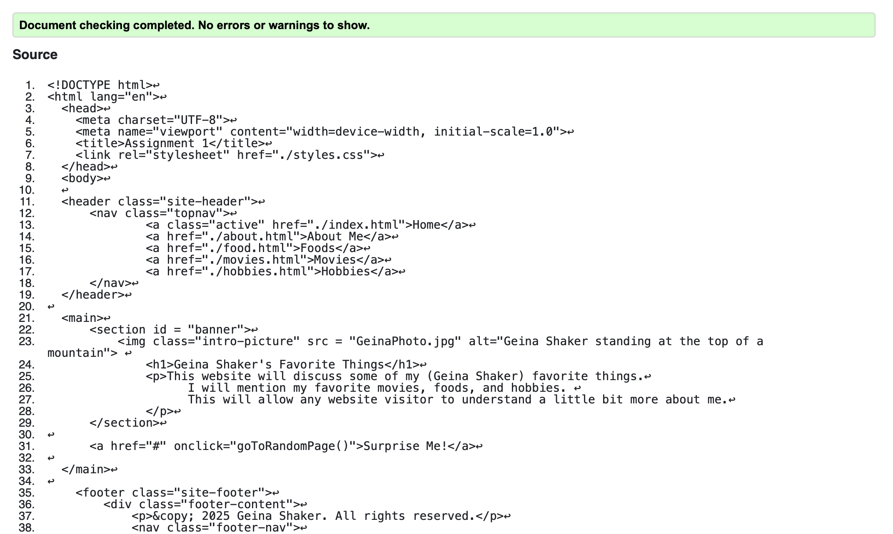
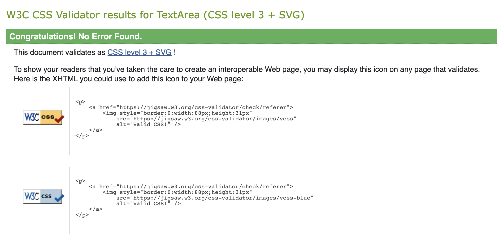

Description of Site:
* This website is about me, Geina Shaker. It covers some basic information about me, and pages that list my favorite foods, movies, and hobbies. It is the perfect way to share some things about me to a stranger in a quick way!

Description of Pages:
* The home page introduces the site and discusses the purpose of the site, along with a photo of me and a button to take the user to a random page on the site.
* The "about me" page includes a paragraph with basic information about me, along with four photos of me.
* The "foods" page has a paragraph that mentions my interest in food, as well as a table that lists my favorite etrees, sides, and desserts.
* The "movies" page has a paragraph that mentions some information about my love for movies, along with a list of my favorite movies, links to those movies, and my ratings for them.
* The "hobbies" page gives some information about my interest in hobbies, along with an ordered list of my favorite hobbies, and a button that shows a picture of one of my paintings when pressed.

HTML Element Usage:
* I used several HTML elements including, headers, paragraphs, nav, section, div, span, img, links, footer, captions, tables, and lists. These elements allow me to give structure to my page and to style elements in groups. Tables and lists allow me to organize information for the reader. 

Validated aand Passed Validation using:
* HTML: https://validator.w3.org/
        
* CSS: https://jigsaw.w3.org/css-validator/
        

Javascript Description:
* Function 1: "toggleImage()" is a function for an image of my painting to appear on hobbies page when the 'See Painting!' button is pressed.
* Function 2: goToRandomPage() is a function that is initiated when the 'Surprise Me!' link is pressed on the home page. It takes the user to a random page in the website from the home page.
* Mouseover Event Listeners for "#banner p": The paragraph on the home page becomes underlined while the mouse is over the words. The underline disappears when no longer hovered over.
* Keydown Event Listeners for "banner": The background color of the banner on the home page switches to blue when the 'b' key is pressed. The background color is changed to orange when the 'o' key is pressed.
